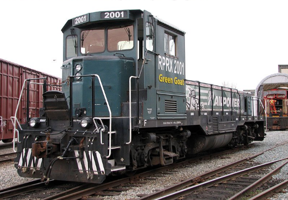
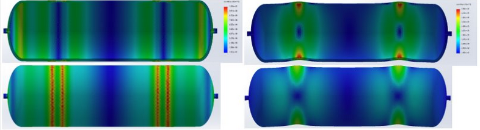

[Home](/README.md)

# Capstone Project Entry

Our capstone project was to design a storage solution for the 'Green Goat' locomotive, made to endure harsh operating conditions and high loads, while being modular, cost effective, and fitting inside a limited space.

<figure>
    
    <figcaption align="center">The Green Goat switching locomotive.</figcaption>
</figure>

Our complete design report is available below for download <a href="files/designreport.pdf" download="designreport.pdf">here</a> if desired.

## Objectives

My personal objectives for my Capstone project were:
1. Apply engineering processes and knowledge to a project.
2. Judge how interesting working in the railway industry would be.
3. Make contacts with both railway and non-railway engineering industry insiders.
4. Learn how to solve problems outside of the scope of a course with easily available relevant information, instead learning about project-specific information with external resources.

Maybe some impersonal objectives? like what?
Project success basically

## Processes

Our project process was rather iterative, however it can be boiled down into the following steps:

First, we needed to define our problem, which is absolutely critical to the project success. Without a well-defined problem, the client can be unsatisfied with our design and ultimately be worse off compared to where they were initially, either financially and/or time-wise. After an initial meeting to clarify the project description of the capstone proposal and identifying stakeholders in our project, we realized that we would need to build a space and cost effective solution to containing hydrogen tanks. Having defined this, we needed to formulate design specifications.

### Design Specifications

After brainstorming relevant criteria and discussing with the client, we realized that our design had lots of aspects which were more of a preference rather than required performance necessities. Because of this, we decided to classify our design specifications into wants and needs. This distinction allowed us to focus our design on aspects which were more critical to the performance. As seen in the flowchart above, the primary required design specifications included load requirements, hydrogen capacity requirements, and operating conditions. Whereas our primary desired design specifications included modularity, maintainability, and operational aids. A complete list of design specifications, their classifications, and associated measurement criteria may be found in our final report.

### Tank Selection

A really interesting component of our project was the selection of the hydrogen storage tanks to be used. The selection of the tanks is the primary driving factor for the entire rest of the design, as well as accounting for most of the costs. Hydrogen tanks come in a couple of different 'types', although only type 3 (A carbon fiber wrap over an aluminium liner) and type 4 (A carbon fiber wrap over a plastic liner) were considered. We were initially given a recommendation from our client to utilize type 3 tanks, although we also researched type 4 hydrogen tanks. While the type 4 tanks were more expensive normalized by capacity, they did significantly expand our selection of tanks to choose from. This was a significant problem in our design, unfortunately. We were only able to get prices for a select number of tanks, and while we still included them for reference, we decided that we would not be able to recommend a tank without a quoted price. Our second round of eliminations was also very limiting, as to fit in the desired space the tanks needed to fit almost perfectly. These factors limited our entire selection to a single hydrogen tank. While a Multiple-Criteria Decision Analysis method was implemented, without the proper data it ultimately was unused.

### Tank Mounting

Mounting hydrogen tanks to a fixed point is quite difficult, as hydrogen tanks are prone to expanding and contracting, both length-wise and radially, as they are refilled and emptied. This limits the available mounting options to those which have already been well defined by the market, either a single rigid 'neck mount' which contrained the tank at one end, or multiple radially-flexible hoop-and-saddle mounts. The saddle mounts were utilized as they could meet the massive load requirements of the cradle and only came with minor drawbacks in the form of needing replacement as they aged.

### Cradle Design

As our tank selection, tank mounting, and tank packing ideas evolved, so did our cradle design.

#### Design Iteration 1

Our first design maximized the modularity design criteria, and included a suspension system which was designed to prevent the immense loads required from rupturing the tanks. For this preliminary design, the tanks were considered to be generalized hydrogen tanks in a 2x2 configuration. This made the assembly very large, significantly outside of the space available for the design.

#### Design Iteration 2

  After selecting our tank, a FEM analysis was performed on the hydrogen tanks, considering only the rigid carbon fiber wrap as load bearing in order to assess whether the tank structure would be susceptible to damage. The tanks were subjected to 7g lateral and longitudinal loads emminating from 2 mounts, utilizing a fine mesh and estimated full tank weights. Resulting from this, we found that the tanks would have very high safety factors, and thus we decided to remove the suspension system from our design. This significantly reduced the design cost, complexity, and space required.

Another focus of this design was to reduce the size and increase maintainability by reducing the level of modularity of our design. Previously, each tank had its own containing frame, each of which were bolted together to form the entire assembly. With this update, the collection of 8 required tanks was taken as one module, which better fit the purpose of the modularity desired from the project. This is because the idea of the cradle was to be able to stack multiple of them vertically in order to install them inside conventional locomotives during retrofits which featured significantly higher hoods than in the switching locomotive we were designing for.

#### Design Iteration 3

While we significantly improved the height of the cradle in the second design iteration, we were still significantly outside of our desired height specification. In order to address this, the packing of the cylinders was significantly improved at the expense of modularity. Ultimately, the client preferred the tighter spacing over the improved capacity in the stacked state, so this configuration was finalized.

## Outcomes
Talk about how combination of poor info and driving design factor was not good and room for improvement.
