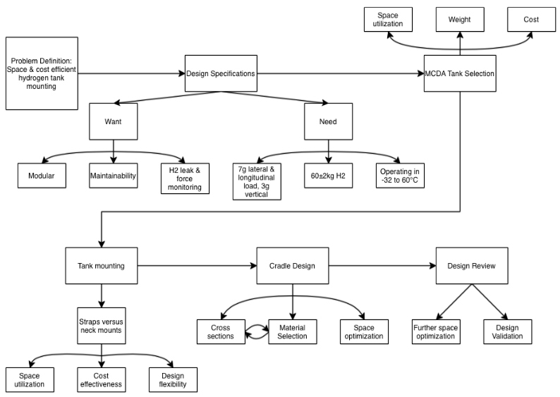

[Home](/README.md)

# Project Entry

## Objectives

My personal objectives for my Capstone project were:
1. Apply engineering processes and knowledge to a project.
2. Judge how interesting working in the railway industry would be.
3. Make contacts with both railway and non-railway engineering industry insiders.
4. Learn how to solve problems outside of the scope of a course with easily available relevant information, instead learning about project-specific information with external resources.

Maybe some impersonal objectives? like what?
Project success basically

## Processes

    Our project process was rather iterative, however it can be boiled down into the following steps:

That is a basic markdown image, here is an hmtl image(?)

### Design Specifications

### Tank Selection

### Tank Mounting

### Cradle Design

#### Design Iteration 1

#### Design Iteration 2

#### Design Iteration 3

#### Design Iteration 4

Challenges in each phase of design!
Key design decisions described in detail!
* Add descriptive captions to provide clarity and context

## Outcomes

